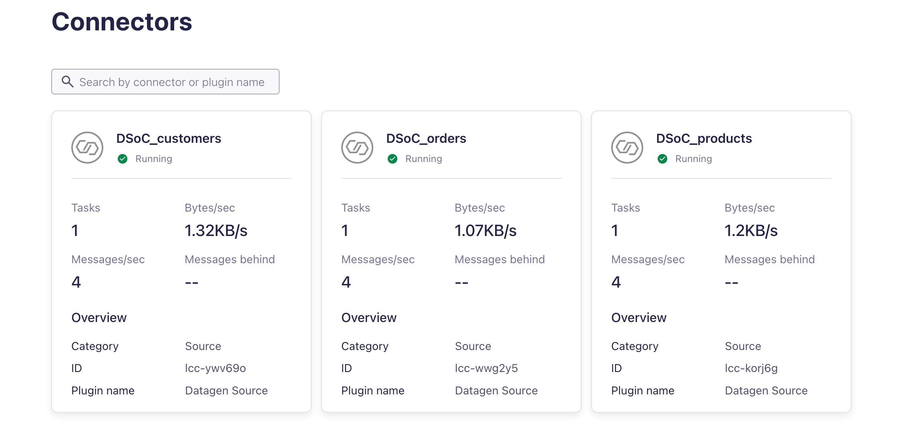

# Terraform Demo

## Create a Cloud API Key

1. Create a [service account](https://docs.confluent.io/cloud/current/access-management/identity/service-accounts.html) called `tf_runner`in Confluent Cloud
2. Assign the `OrganizationAdmin` [role](https://docs.confluent.io/cloud/current/access-management/access-control/cloud-rbac.html#organizationadmin) to the `tf_runner` service account
3. Create a [Cloud API Key](https://docs.confluent.io/cloud/current/access-management/authenticate/api-keys/api-keys.html#cloud-cloud-api-keys) for the `tf_runner` service account*

## Terraform configuration

This demos has two files:

* main.tf
* cflt_connectors.tf

These two files will create the following:

* confluent_environment: provides an Environment resource. The resource lets you create, edit and delete environments on Confluent Cloud.
* confluent_schema_registry_cluster: describes a Schema Registry cluster data source.
* confluent_kafka_cluster: provides a Kafka cluster resource that enables creating, editing, and deleting Kafka clusters on Confluent Cloud.
* confluent_service_account: provides a Service Account resource that enables creating, editing, and deleting service accounts on Confluent Cloud.
* confluent_role_binding: provides a Role Binding resource that enables creating, reading, and deleting role bindings on Confluent Cloud.
* confluent_api_key: provides an API Key resource that enables creating, editing, and deleting Cloud API Keys, Cluster API Keys (Kafka API Key, ksqlDB API Key, Schema Registry API Key, Flink API Key) on Confluent Cloud.
* confluent_kafka_topic: provides a Kafka Topic resource that enables creating and deleting Kafka Topics on a Kafka cluster on Confluent Cloud.
* confluent_kafka_acl: provides a Kafka ACL resource that enables creating and deleting Kafka ACLs on Confluent Cloud.
* confluent_tag: provides a Tag resource that enables creating, editing, and deleting Tags on Confluent Cloud.
* confluent_tag_binding: provides a Tag Binding resource that enables creating, editing, and deleting Tag Bindings on Confluent Cloud.
* confluent_connector: provides a connector resource that enables creating, editing, and deleting connectors on Confluent Cloud.

## Terraform initializes

The terraform init command initializes a working directory containing Terraform configuration files. This is the first command that should be run after writing a new Terraform configuration or cloning an existing one from version control. It is safe to run this command multiple times.

```
terraform init
```

## Use cloud API Key

Use the saved Cloud API Key of the `tf_runner` service account to set values to the `confluent_cloud_api_key` and `confluent_cloud_api_secret` input variables [using environment variables](https://www.terraform.io/language/values/variables#environment-variables):

```
export TF_VAR_confluent_cloud_api_key="<cloud_api_key>"
export TF_VAR_confluent_cloud_api_secret="<cloud_api_secret>"
```

## Terraform plan

The `terraform plan` command creates an execution plan, which lets you preview the changes that Terraform plans to make to your infrastructure. By default, when Terraform creates a plan it:

* Reads the current state of any already-existing remote objects to make sure that the Terraform state is up-to-date.
* Compares the current configuration to the prior state and noting any differences.
* Proposes a set of change actions that should, if applied, make the remote objects match the configuration.

```
terraform plan
```

## Terraform apply

The `terraform apply` command executes the actions proposed in a Terraform plan.

```
terraform apply
```

You have now created infrastructure using Terraform! Visit the [Confluent Cloud Console](https://confluent.cloud/environments) or use the [Confluent CLI](https://docs.confluent.io/confluent-cli/current/install.html#install-confluent-cli) to see the resources you provisioned.

## Produce data

Change configuration file named cloud_sasl_app-producer.config

```
jq '.resources[] | select(.name == "app-producer-kafka-api-key") | .instances[] | {id: .attributes.id, secret: .attributes.secret}' terraform.tfstate
```

Produce data with kafka cli

```
kafka-console-producer --bootstrap-server pkc-qr9n1m.spaincentral.azure.confluent.cloud:9092 --topic orders --producer.config ../cloud_sasl_app-producer.config
```

## Consume data

Change configuration file named cloud_sasl_app-consumer.config

```
jq '.resources[] | select(.name == "app-consumer-kafka-api-key") | .instances[] | {id: .attributes.id, secret: .attributes.secret}' terraform.tfstate
```

Consume data using kafka cli

```
kafka-console-consumer --bootstrap-server pkc-qr9n1m.spaincentral.azure.confluent.cloud:9092 --topic orders --consumer.config ../cloud_sasl_app-consumer.config --from-beginning --group confluent_cli_consumer_1
```

## Check connector

Navigate to connector screen. There are three connectors.




# Open Policy Agent

The Open Policy Agent is an open source, general-purpose policy engine that unifies policy enforcement across the stack. OPA provides a high-level declarative language that lets you specify policy as code and simple APIs to offload policy decision-making from your software. You can use OPA to enforce policies in microservices, Kubernetes, CI/CD pipelines, API gateways, and more.

## Create a Terraform plan

Then initialize Terraform and ask it to calculate what changes it will make and store the output in `plan.binary`.

```
terraform init
terraform plan --out policy/tfplan.binary
```

## Convert the Terraform plan into JSON

Use the command [terraform show](https://www.terraform.io/docs/commands/show.html) to convert the Terraform plan into JSON so that OPA can read the plan.

```
terraform show -json tfplan.binary > tfplan.json
```

## Write the OPA policy to check the plan

In the file `policy_allow.rego` you have some examples policies like:

* Cluster must start with a prefix
* Topic must start with a prefix
* API key must be admin

## Execute OPA

```
opa eval -i tfplan.json  --data users_roles.json  -d policy_allow.rego "data.terraform.policy"
```

The output is similar to.

```
{
  "result": [
    {
      "expressions": [
        {
          "value": {
            "allow": false,
            "deny": [
              "El clúster de Confluent Kafka debe empezar por JSOTO.",
              "Los topicos deben empezar por 'shoe'. Lo incumple el tópico: "
            ]
          },
          "text": "data.terraform.policy",
          "location": {
            "row": 1,
            "col": 1
          }
        }
      ]
    }
  ]
}
```


